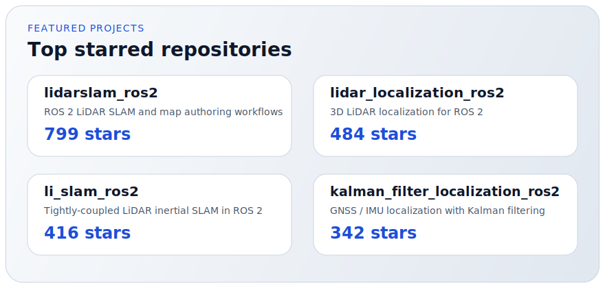

# Hi, I'm Ryohei Sasaki

Robotics software engineer at MAP IV (TIER IV group), based in Japan.

I build open-source tools for LiDAR SLAM, localization, GNSS/IMU fusion, and performance-oriented robotics systems in C++, Rust, CUDA, and ROS 2.

Nearly 3k GitHub stars across public repositories, centered on practical robotics software.

  
  
  

## Focus Areas

- ROS 2 and Autoware-related development
- LiDAR SLAM and localization
- GNSS, IMU, and sensor fusion
- Rust and modern C++ for robotics
- GPU acceleration for perception and optimization

## Open Source Snapshot

  

## Featured Projects

  

- [lidarslam_ros2](https://github.com/rsasaki0109/lidarslam_ros2) - 799 stars
- [lidar_localization_ros2](https://github.com/rsasaki0109/lidar_localization_ros2) - 484 stars
- [li_slam_ros2](https://github.com/rsasaki0109/li_slam_ros2) - 416 stars
- [kalman_filter_localization_ros2](https://github.com/rsasaki0109/kalman_filter_localization_ros2) - 342 stars
