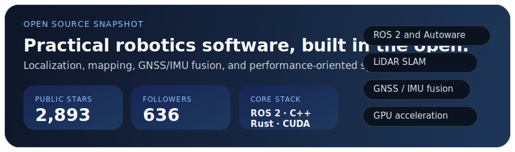

# Hi, I'm Ryohei Sasaki

Robotics software engineer at MAP IV (TIER IV group), based in Japan.

I build open-source tools for LiDAR SLAM, localization, GNSS/IMU fusion, and performance-oriented robotics systems in C++, Rust, CUDA, and ROS 2.

  
  
  

## Open Source Snapshot

## Selected Repositories

### Top Starred

- **[lidar_slam_ros2](https://github.com/rsasaki0109/lidar_slam_ros2)** · **800 stars** · ROS 2 LiDAR SLAM for pointcloud-map authoring, benchmarking, and Autoware-compatible map workflows.
- **[lidar_localization_ros2](https://github.com/rsasaki0109/lidar_localization_ros2)** · **490 stars** · 3D LiDAR localization with NDT/GICP and pointcloud maps in ROS 2.
- **[li_slam_ros2](https://github.com/rsasaki0109/li_slam_ros2)** · **417 stars** · Tightly-coupled LiDAR inertial SLAM for ROS 2.
- **[kalman_filter_localization_ros2](https://github.com/rsasaki0109/kalman_filter_localization_ros2)** · **345 stars** · GNSS / IMU localization using Kalman filtering.
- **[rust_robotics](https://github.com/rsasaki0109/rust_robotics)** · **217 stars** · Robotics algorithms and reference implementations in Rust.
- **[lidar_localizer](https://github.com/rsasaki0109/lidar_localizer)** · **188 stars** · LiDAR localizer for Autoware AI.
- **[gnssplusplus-library](https://github.com/rsasaki0109/gnssplusplus-library)** · **138 stars** · Modern C++ GNSS / RTK / PPP / CLAS toolkit.

### Recent Active

- **[gnss_gpu](https://github.com/rsasaki0109/gnss_gpu)** · **44 stars** · GPU-accelerated GNSS signal processing in CUDA + Python.
- **[localization_zoo](https://github.com/rsasaki0109/localization_zoo)** · **17 stars** · Recent localization baselines, derived variants, tests, and benchmarks.
- **[CloudAnalyzer](https://github.com/rsasaki0109/CloudAnalyzer)** · **13 stars** · CLI-first QA toolkit for point clouds, trajectories, and 3D perception outputs.
- **[simple_visual_slam](https://github.com/rsasaki0109/simple_visual_slam)** · **3 stars** · Readable Visual SLAM in 6k lines of C++17 with ROS 2 nodes.
- **[lidar_slam_2d](https://github.com/rsasaki0109/lidar_slam_2d)** · **3 stars** · 2D LiDAR SLAM experiment platform with Cartographer parity and benchmark-driven iteration.

## Featured Repositories

<table>
  <tr>
    <td valign="top" width="50%">
      <strong><a href="https://github.com/rsasaki0109/lidar_slam_ros2">lidar_slam_ros2</a></strong> 
      <strong>800 stars</strong> 
      ROS 2 LiDAR SLAM for pointcloud-map authoring, benchmarking, and Autoware-compatible map workflows.
        
      
    </td>
    <td valign="top" width="50%">
      <strong><a href="https://github.com/rsasaki0109/lidar_localization_ros2">lidar_localization_ros2</a></strong> 
      <strong>490 stars</strong> 
      3D LiDAR localization with NDT/GICP and pointcloud maps in ROS 2.
        
      
    </td>
  </tr>
  <tr>
    <td valign="top" width="50%">
      <strong><a href="https://github.com/rsasaki0109/li_slam_ros2">li_slam_ros2</a></strong> 
      <strong>417 stars</strong> 
      Tightly-coupled LiDAR inertial SLAM for ROS 2.
        
      
    </td>
    <td valign="top" width="50%">
      <strong><a href="https://github.com/rsasaki0109/kalman_filter_localization_ros2">kalman_filter_localization_ros2</a></strong> 
      <strong>345 stars</strong> 
      GNSS / IMU localization using Kalman filtering.
        
      
    </td>
  </tr>
  <tr>
    <td valign="top" width="50%">
      <strong><a href="https://github.com/rsasaki0109/rust_robotics">rust_robotics</a></strong> 
      <strong>217 stars</strong> 
      Robotics algorithms and reference implementations in Rust.
        
      
    </td>
    <td valign="top" width="50%">
      <strong><a href="https://github.com/rsasaki0109/gnssplusplus-library">gnssplusplus-library</a></strong> 
      <strong>138 stars</strong> 
      Modern C++ GNSS / RTK / PPP / CLAS toolkit.
        
      
    </td>
  </tr>
  <tr>
    <td valign="top" width="50%">
      <strong><a href="https://github.com/rsasaki0109/gnss_gpu">gnss_gpu</a></strong> 
      <strong>44 stars</strong> 
      GPU-accelerated GNSS signal processing in CUDA + Python.
        
      
    </td>
    <td valign="top" width="50%">
      <strong><a href="https://github.com/rsasaki0109/CloudAnalyzer">CloudAnalyzer</a></strong> 
      <strong>13 stars</strong> 
      CLI-first QA toolkit for point clouds, trajectories, and 3D perception outputs.
        
      
    </td>
  </tr>
  <tr>
    <td valign="top" width="50%">
      <strong><a href="https://github.com/rsasaki0109/dynamic-3d-object-removal">dynamic-3d-object-removal</a></strong> 
      <strong>31 stars</strong> 
      LiDAR dynamic object removal with public demos and a ROS 2 realtime node.
        
      
    </td>
    <td valign="top" width="50%">
      <strong><a href="https://github.com/rsasaki0109/localization_zoo">localization_zoo</a></strong> 
      <strong>17 stars</strong> 
      Recent localization baselines, derived variants, tests, and benchmarks.
        
      
    </td>
  </tr>
</table>
