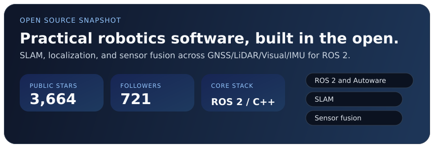

# Hi, I'm Ryohei Sasaki

Robotics software engineer at MAP IV (TIER IV group), based in Japan.

I build open-source tools for LiDAR SLAM, localization, GNSS/IMU fusion, and performance-oriented robotics systems in C++, Rust, CUDA, and ROS 2.

  
  
  

## Open Source Snapshot

## Selected Repositories

### Top Starred

- **[lidar_slam_ros2](https://github.com/rsasaki0109/lidar_slam_ros2)** · **815 stars** · ROS 2 LiDAR SLAM for pointcloud-map authoring, benchmarking, and Autoware-compatible map workflows.
- **[lidar_localization_ros2](https://github.com/rsasaki0109/lidar_localization_ros2)** · **511 stars** · 3D LiDAR localization with NDT/GICP and pointcloud maps in ROS 2.
- **[li_slam_ros2](https://github.com/rsasaki0109/li_slam_ros2)** · **424 stars** · Tightly-coupled LiDAR inertial SLAM for ROS 2.
- **[kalman_filter_localization_ros2](https://github.com/rsasaki0109/kalman_filter_localization_ros2)** · **350 stars** · GNSS / IMU localization using Kalman filtering.
- **[rust_robotics](https://github.com/rsasaki0109/rust_robotics)** · **226 stars** · Robotics algorithms and reference implementations in Rust.
- **[lidar_localizer](https://github.com/rsasaki0109/lidar_localizer)** · **187 stars** · LiDAR localizer for Autoware AI.
- **[gnssplusplus-library](https://github.com/rsasaki0109/gnssplusplus-library)** · **162 stars** · Modern C++ GNSS / RTK / PPP / CLAS toolkit.

### Recent Active

- **[CudaRobotics](https://github.com/rsasaki0109/CudaRobotics)** · **82 stars** · CUDA-accelerated robotics algorithms in C++ with 20+ SLAM, planning, and localization demos.
- **[gnss_gpu](https://github.com/rsasaki0109/gnss_gpu)** · **56 stars** · GPU-accelerated GNSS signal processing in CUDA + Python.
- **[localization_zoo](https://github.com/rsasaki0109/localization_zoo)** · **37 stars** · Recent localization baselines, derived variants, tests, and benchmarks.
- **[CloudAnalyzer](https://github.com/rsasaki0109/CloudAnalyzer)** · **13 stars** · CLI-first QA toolkit for point clouds, trajectories, and 3D perception outputs.

<table>
  <tr>
    <td valign="top" width="50%">
      
       
      <strong><a href="https://github.com/rsasaki0109/CudaRobotics">CudaRobotics</a></strong> · 82 stars
    </td>
    <td valign="top" width="50%">
      
       
      <strong><a href="https://github.com/rsasaki0109/gnss_gpu">gnss_gpu</a></strong> · 56 stars
    </td>
  </tr>
  <tr>
    <td valign="top" width="50%">
      
       
      <strong><a href="https://github.com/rsasaki0109/localization_zoo">localization_zoo</a></strong> · 37 stars
    </td>
    <td valign="top" width="50%">
      
       
      <strong><a href="https://github.com/rsasaki0109/CloudAnalyzer">CloudAnalyzer</a></strong> · 13 stars
    </td>
  </tr>
</table>

## Featured Repositories

<table>
  <tr>
    <td valign="top" width="50%">
      <strong><a href="https://github.com/rsasaki0109/lidar_slam_ros2">lidar_slam_ros2</a></strong> 
      <strong>815 stars</strong> 
      ROS 2 LiDAR SLAM for pointcloud-map authoring, benchmarking, and Autoware-compatible map workflows.
        
      
    </td>
    <td valign="top" width="50%">
      <strong><a href="https://github.com/rsasaki0109/li_slam_ros2">li_slam_ros2</a></strong> 
      <strong>424 stars</strong> 
      Tightly-coupled LiDAR inertial SLAM for ROS 2.
        
      
    </td>
  </tr>
  <tr>
    <td valign="top" width="50%">
      <strong><a href="https://github.com/rsasaki0109/kalman_filter_localization_ros2">kalman_filter_localization_ros2</a></strong> 
      <strong>350 stars</strong> 
      GNSS / IMU localization using Kalman filtering.
        
      
    </td>
    <td valign="top" width="50%">
      <strong><a href="https://github.com/rsasaki0109/lidar_localization_ros2">lidar_localization_ros2</a></strong> 
      <strong>511 stars</strong> 
      3D LiDAR localization with NDT/GICP and pointcloud maps in ROS 2.
        
      
    </td>
  </tr>
  <tr>
    <td valign="top" width="50%">
      <strong><a href="https://github.com/rsasaki0109/rust_robotics">rust_robotics</a></strong> 
      <strong>226 stars</strong> 
      Robotics algorithms and reference implementations in Rust.
        
      
    </td>
    <td valign="top" width="50%">
      <strong><a href="https://github.com/rsasaki0109/gnssplusplus-library">gnssplusplus-library</a></strong> 
      <strong>162 stars</strong> 
      Modern C++ GNSS / RTK / PPP / CLAS toolkit.
        
      
    </td>
  </tr>
  <tr>
    <td valign="top" width="50%">
      <strong><a href="https://github.com/rsasaki0109/gnss_gpu">gnss_gpu</a></strong> 
      <strong>56 stars</strong> 
      GPU-accelerated GNSS signal processing in CUDA + Python.
        
      
    </td>
    <td valign="top" width="50%">
      <strong><a href="https://github.com/rsasaki0109/localization_zoo">localization_zoo</a></strong> 
      <strong>37 stars</strong> 
      Recent localization baselines, derived variants, tests, and benchmarks.
        
      
    </td>
  </tr>
  <tr>
    <td valign="top" width="50%">
      <strong><a href="https://github.com/rsasaki0109/CudaRobotics">CudaRobotics</a></strong> 
      <strong>82 stars</strong> 
      CUDA-accelerated robotics algorithms in C++ with 20+ SLAM, planning, and localization demos.
        
      
    </td>
    <td valign="top" width="50%">
      <strong><a href="https://github.com/rsasaki0109/dynamic-3d-object-removal">dynamic-3d-object-removal</a></strong> 
      <strong>72 stars</strong> 
      LiDAR dynamic object removal with public demos and a ROS 2 realtime node.
        
      
    </td>
  </tr>
</table>
